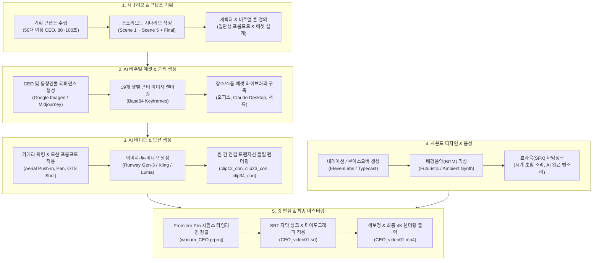

# 🎬 생성형 AI로 달라진 CEO의 하루 - 영상 제작 플로우차트 & 타임라인

본 문서는 **"생성형 AI로 달라진 CEO의 하루"** 시네마틱 브랜디드 영상 프로젝트의 전체 제작 파이프라인과 타임라인 구조를 시각화한 프로덕션 가이드입니다.

---

## 1. 전체 영상 제작 파이프라인 (Mermaid Flowchart)

---

## 2. 영상 씬 타임라인 간트차트 (Mermaid Gantt Chart)

총 러닝타임 약 80~100초의 씬별 흐름과 자막/감정선 변화를 나타냅니다.

```mermaid
gantt
    title 생성형 AI로 달라진 CEO의 하루 - 타임라인 시퀀스
    dateFormat  X
    axisFormat %s초

    section Scene 1. 늦은 밤의 도시 (야근과 번아웃)
    Shot 01 도시 야경 푸시인 (차갑고 외로운 톤)       :0, 8
    Shot 02 모니터 앞 피로한 CEO (푸른 조명)         :8, 18
    Shot 03 산더미 같은 서류와 깊은 한숨             :18, 26

    section Scene 2. 생성형 AI 교육 (새로운 발견)
    Shot 04 대형 화면 '생성형 AI 활용 교육'         :26, 32
    Shot 05 교육장 전경과 집중하는 CEO              :32, 38
    Shot 06 직접 노트북 프롬프트 입력 실습           :38, 44
    Shot 07 결과 확인 후 놀람과 미소                 :44, 50

    section Scene 3. AI와 시작하는 아침 (모닝 루틴)
    Shot 08 활기찬 아침 출근과 커피                  :50, 56
    Shot 09 일정 및 업무 우선순위 프롬프트 입력      :56, 62
    Shot 10 정리된 일정 확인 및 만족스러운 끄덕임     :62, 68

    section Scene 4. 실무 혁신 (초고속 업무 처리)
    Shot 11 수십 페이지 회의자료 초고속 요약        :68, 74
    Shot 12 전문 비즈니스 영문 이메일 폴리싱         :74, 80
    Shot 13 화이트보드 앞 신사업 아이디어 확장       :80, 87

    section Scene 5. 여유로운 오피스 (워라밸 달성)
    Shot 14 햇살 가득한 깔끔한 CEO 집무실            :87, 94
    Shot 15 Claude Desktop '작업 완료' 메시지        :94, 100
    Shot 16 여유로운 미소와 깊은 휴식                :100, 106

    section Final Shot. 엔딩 카피 & 여운
    Shot 17 창밖을 바라보는 당당한 CEO               :106, 112
    Shot 18 도시 원경 페이드아웃 (따뜻한 낮 도시)    :112, 117
    Shot 19 엔딩 슬로건 카피 & 페이드아웃            :117, 122
```

---

## 3. 씬/샷별 상세 제작 메타데이터 & AI 프롬프트 가이드

| 씬 번호 | 샷 번호 | 샷 타이틀 | 카메라 모션 | 비주얼 & 조명 톤 | 핵심 오디오 / 자막 |
| :--- | :--- | :--- | :--- | :--- | :--- |
| **Scene 1** | **Shot 01** | The Lonely Skyscraper | Wide aerial shot → slow push-in | 딥 블루, 차가운 그레이, 고립된 사무실 불빛 | 도시 밤소음, 차가운 바람소리 |
| **Scene 1** | **Shot 02** | The Fatigued CEO | Medium close-up on CEO | 푸른 모니터 반사광, 지친 50대 여성 CEO 표정 | 나즈막한 키보드 타건음 |
| **Scene 1** | **Shot 03** | Buried in Paperwork | Slow pan across desk documents | 서류 더미, 늦은 밤 사무실의 정적 | 공조기 소리, CEO의 깊은 한숨 |
| **Scene 2** | **Shot 04** | The Training Screen | Low-angle medium-wide | 밝은 자연광, 대형 디스플레이 | 명확하고 자신감 있는 강사 음성 |
| **Scene 2** | **Shot 05** | The Training Session | Over-the-shoulder shot | 집중하는 교육생들과 CEO | 강사 강의 및 마우스 클릭음 |
| **Scene 2** | **Shot 06** | Hands-On Experience | Extreme close-up on keyboard/screen | 빠른 타이핑, AI 생성 로딩 애니메이션 | 빠른 키보드 입력 소리 |
| **Scene 2** | **Shot 07** | A Moment of Discovery | Tight close-up reaction | 놀람에서 부드러운 미소로 표정 변화 | 밝은 발견의 배경음 테마 전환 |
| **Scene 3** | **Shot 08** | Morning Office Arrival | Tracking shot following CEO | 아침 자연광, 밝고 따뜻한 오피스 | 경쾌한 발걸음 소리, 모닝 앰비언스 |
| **Scene 3** | **Shot 09** | Prompting the AI | Close-up over shoulder | 커피잔, 깔끔한 챗봇 UI | 부드러운 타건음, 커피잔 놓는 소리 |
| **Scene 3** | **Shot 10** | Organized Schedule Approval | Medium shot with subtle zoom | 정돈된 캘린더, 만족스러운 표정 | "띵" 가벼운 알림음 |
| **Scene 4** | **Shot 11** | Instant Report Synthesis | Split/Screen close-up | 방대한 서류가 3줄 요약으로 정리 | 데이터 처리 펄스 효과음 |
| **Scene 4** | **Shot 12** | Professional Email Polishing | Side profile close-up | 자연스러운 비즈니스 톤으로 문장 변환 | 빠른 텍스트 변환 및 전송음 |
| **Scene 4** | **Shot 13** | Creative Idea Expansion | Medium tracking shot | 화이트보드와 노트북 사이 아이디어 메모 | 영감을 주는 업템포 BGM |
| **Scene 5** | **Shot 14** | A Transformed Space | Smooth glidecam push-in | 서류 더미가 사라진 미니멀한 명품 오피스 | 따뜻한 햇살 앰비언스, 평온한 침묵 |
| **Scene 5** | **Shot 15** | Mission Accomplished | Monitor macro shot | Claude Desktop "작업 완료" 프레젠테이션 | 부드러운 완료 징글음 |
| **Scene 5** | **Shot 16** | Quiet Confidence | Medium-wide portrait | 등받이에 기대며 차 한잔 마시는 CEO | 깊고 편안한 호흡 소리 |
| **Final** | **Shot 17** | The Confident Leader | Low-angle heroic portrait | 당당하고 여유로운 여성 리더의 아우라 | 웅장하고 따뜻한 오케스트라 선율 |
| **Final** | **Shot 18** | Cityscape Pullback | Extreme wide aerial pull-back | 활기차고 눈부신 낮의 도심 전경 | 풍성한 도시의 활력 사운드 |
| **Final** | **Shot 19** | The Final Message | Clean graphic title card | 시네마틱 블랙 & 골드 텍스트 | "일하는 방식이 바뀌면, 우리의 시간도 달라집니다" |

---

## 4. 자막 (SRT) 타임코드 싱크 표

* **00:00:01 ~ 00:00:05**: "늘어나는 서류, 끝없는 결정, 깊어지는 밤…"
* **00:00:05 ~ 00:00:09**: "CEO의 시간은 왜 항상 부족할까요?"
* **00:00:10 ~ 00:00:14**: "반복되는 업무는 AI에게, 시간의 주도권을 되찾다"
* **00:00:14 ~ 00:00:18**: "단 몇 초 만에 완성되는 데이터와 전략 리포트"
* **00:00:19 ~ 00:00:23**: "업무의 압박에서 벗어나, 본질에 집중하는 순간"
* **00:00:23 ~ 00:00:27**: "일하는 방식이 바뀌면, 비즈니스의 격이 달라집니다"
* **00:00:28 ~ 00:00:32**: "더 가치 있는 리더십, 더 여유로운 경영"
* **00:00:33 ~ 00:00:36**: "AI와 함께 시작하는 여성 CEO의 새로운 미래"
* **00:00:37 ~ 00:00:40**: "생성형 AI로 완성하는 스마트 경영 & 리더십"
